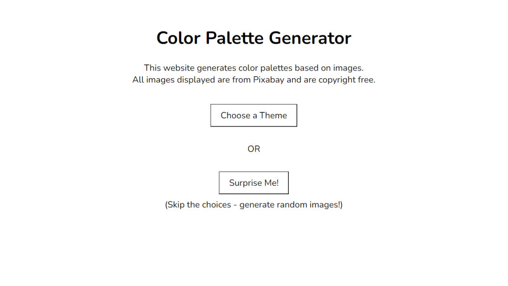
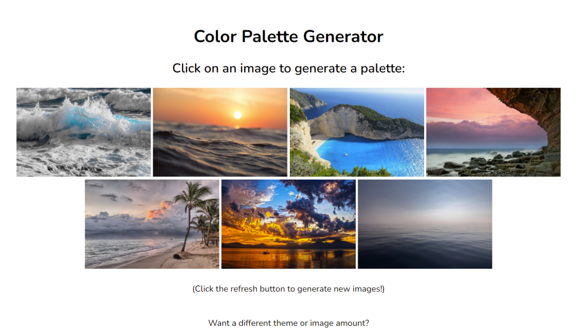
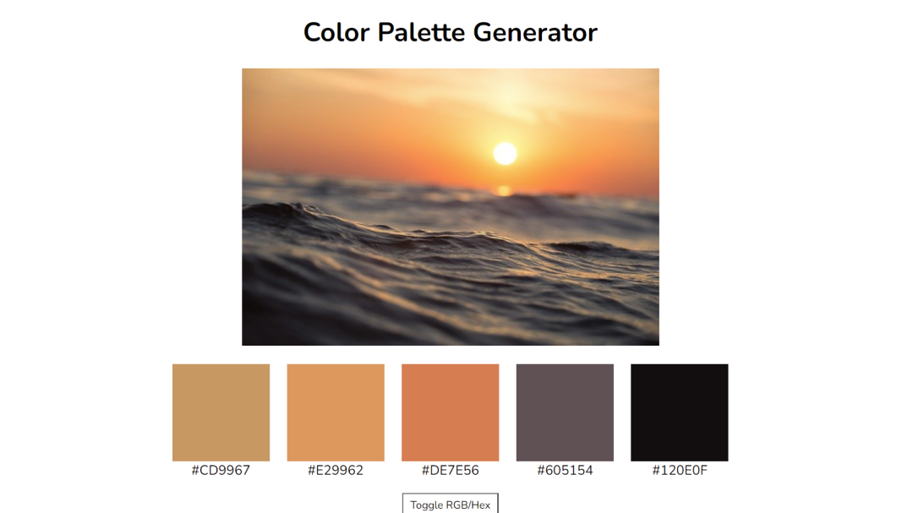

# Color Palette Generator

This Python application, made using Flask, generates color palettes based on themed nature photos. The user can either choose a theme and amount of image choices, or choose "surprise me!" to get a medium amount of random images, and an assortment of nature photos (chosen by a randomizer service) will be displyed. Choosing one of these photos will generate and reveal a color palette based on the colors within the image.

This application was created as a portfolio project for CS 361: Software Engineering I.

## Screenshots of the Final Application
### Home Page

### Images Page

### Palette Page
